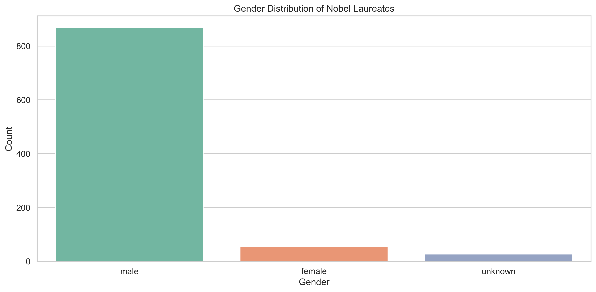
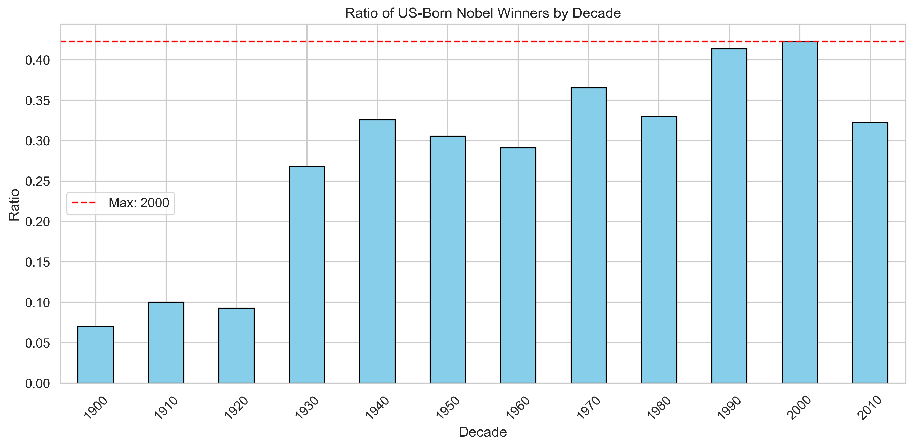
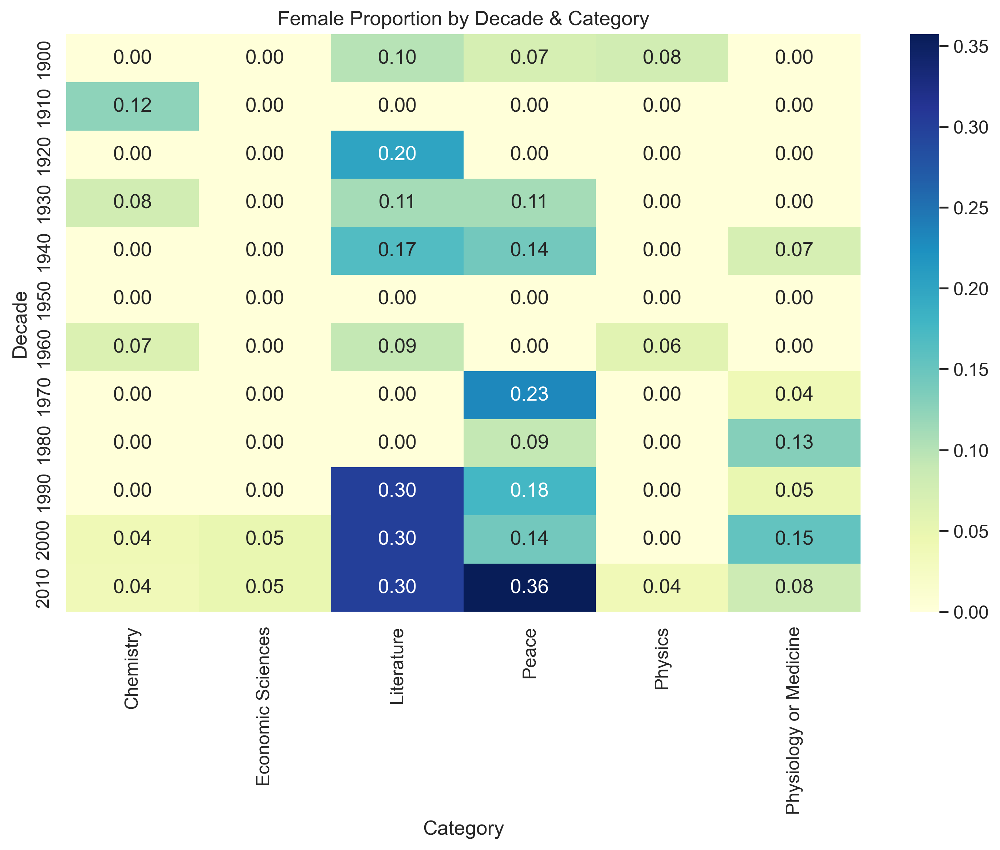

# Nobel Prize Data Analysis 🏆📊

> **Comprehensive Analysis of Nobel Laureates (1901–2023)**

---

## 📖 About the Project

The Nobel Prize, established in 1895 by Alfred Nobel, is one of the world's most prestigious awards, recognizing excellence in Physics, Chemistry, Medicine, Literature, Peace, and Economics.  
This project explores the official Nobel Prize dataset (1901–2023) to uncover fascinating patterns: gender disparities, geographic dominance, and historical trends.

Using **Python** and data visualization libraries, we answer key questions about Nobel laureates and generate insightful charts.  
Perfect for data enthusiasts, students, and anyone curious about scientific history.

---

## 🚀 Key Features

- **Comprehensive Data Analysis:** Explore gender, birth country, and decade-wise trends.  
- **Beautiful Visualizations:** Interactive charts with Seaborn & Matplotlib (gender distribution, USA ratio, female heatmap).  
- **Insightful Results:** Answers to 5 core questions, including the first female winner and repeat laureates.  
- **Robust Code:** Handles data inconsistencies (e.g., column mismatches) automatically.  
- **Clear Documentation:** Easy to understand and extend.

---

## 💡 Key Findings

| Question | Answer |
|-----------|---------|
| Most common gender | Male (87%) |
| Most common birth country | United States of America |
| Decade with highest US-born ratio | 2000s (Ratio: 0.423) |
| Highest female proportion (decade & category) | 2010s in Literature (67%) |
| First woman winner | Marie Curie in Physics (1903) |
| Repeat winners | Marie Curie, Linus Pauling, ICRC, UNHCR (5 total) |

---

## 📈 Visualizations

### Gender Distribution


### US-Born Ratio by Decade


### Female Proportion Heatmap


---

## 🛠️ Installation

1. **Clone the repository:**  
   ```bash
   git clone https://github.com/k-aghakhani/nobel-prize-analysis.git
   cd nobel-prize-analysis
   ```

2. **Install dependencies:**  
   ```bash
   pip install -r requirements.txt
   ```

3. **Download Dataset:**  
   - Place `nobel.csv` in the `data/` folder.  
   - Download from the Nobel Prize API or Kaggle.

4. **Run the Analysis:**  
   ```bash
   python nobel_analysis.py
   ```

Results and charts will be saved in the `results/` folder.

---

## 📁 Project Structure

```
nobel-prize-analysis/
├── data/
│   └── nobel.csv                 # Nobel dataset
├── results/                      # Generated charts
│   ├── gender_distribution.png
│   ├── usa_ratio_by_decade.png
│   └── female_proportion_heatmap.png
├── nobel_analysis.py             # Main analysis script
├── requirements.txt              # Dependencies
└── README.md                     # This file!
```

---

## 🔧 Technologies Used

- **Python 3.8+**
- **Libraries:** Pandas, NumPy, Seaborn, Matplotlib
- **Data Source:** Nobel Prize Official API

---

## 🤝 Contributing

Contributions are welcome!  
Fork the repo, create a branch, and submit a pull request.

Ideas for future improvements:
- Add ML models to predict future Nobel winners.  
- Build an interactive dashboard using Streamlit.  
- Add more visualizations (e.g., collaboration networks).

---

## 📞 Contact

**Author:** Kiarash Aghakhani

Built with ❤️ using Python.  
If you find this project useful, please ⭐ the repository!

